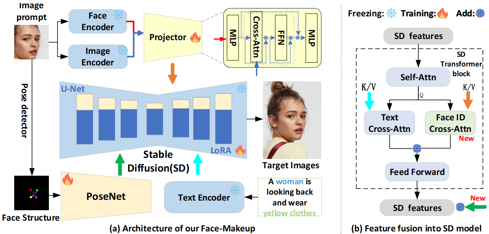

# FaceMaker-V0

## News and Update 🔥🔥🔥

- Dec.28, 2024. **[FaceMaker-V0](https://huggingface.co/OpenFace-CQUPT/Face-MakeUp_SD1.5), is released!👏👏👏**


## Demo


https://github.com/user-attachments/assets/392f4f86-92e2-4c28-b8a7-fb724b098678


## FaceCaptionHQ-4M

We constructed a large-scale facial image-text dataset for facial image generation task.

[](https://huggingface.co/datasets/OpenFace-CQUPT/FaceCaption-15M)

We utilize the information of FaceCaption-15M  (each image in FaceCaption-15M corresponds one image in LAIONFace) to clean the LAION-Face data efficiently. Specifically: (1) We sorted the images in FaceCaption-15M by resolution, and selected the top 10M images from LAION-Face; (2) We removed black-and-white images by checking whether the mean of the standard deviation exceeds a set threshold to ensure the selection of color images; (3) We employed an OCR text detection model to eliminate images containing a large amount of text; (4) We removed the group photos containing multiple faces by using the yolov5-face model; (5) We eliminated cartoon-style images using a cascade classifier based on LBP to detect anime-style faces within the images. Finally, we obtained a 4.2M highquality human-scene images.

## Model


 (1) the inputs of Face-MakeUp include a reference facial image, a pose map that extracted from the reference image, and text prompt; (2) facial features extraction modules, which includes general and specialized visual encoders as well as a learning module for pose map; (3) a pre-trained text-to-image diffusion model; and (4) a cross-attention module is designed to learn the joint representation of facial image (reference) and text prompts. In addition, embeddings of pose map are integrated through an additive way (b). This final embeddings are then incorporated into the feature space of the diffusion model through an overlay method, which enriches the feature space of the diffusion model with more information of the reference facial image, thereby ensuring consistency between the generated image and the reference image.

## Results
**Unsplash-Face**

| Method            | CLIP-T ↑ | CLIP-I ↑ | DINO ↑   | FaceSim ↑ | FID ↓     | Attr_c ↑ | VLM-score ↑ |
| ----------------- | -------- | -------- | -------- | --------- | --------- | -------- | ----------- |
| Ip-Adapter.(2023) | 27.7     | 64.9     | 37.6     | 53.2      | 226.9     | 3.0      | 65.3        |
| PhotoMaker.(2023) | 28.2     | 56.5     | 26.2     | 20.7      | 224.4     | 2.2      | 60.1        |
| InstantID.(2024)  | 24.8     | 78.0     | 49.4     | **71.2**  | 178.7     | 3.8      | 54.8        |
| Pulid.(2024)      | **29.3** | 46.3     | 21.0     | 24.3      | 284.5     | 2.4      | 36.5        |
| Ours              | 22.3     | **82.1** | **73.2** | 69.2      | **130.1** | **4.0**  | **79.6**    |

**FaceCaption**

| Method            | CLIP-T ↑  | CLIP-I ↑ | DINO ↑   | FaceSim ↑ | FID ↓    | Attr_c ↑ | VLM-score ↑ |
| ----------------- | --------- | -------- | -------- | --------- | -------- | -------- | ----------- |
| Ip-Adapter.(2023) | 26.78     | 69.7     | 48.0     | 59.2      | 195.4    | 3.2      | 63.2        |
| PhotoMaker.(2023) | 28.12     | 50.5     | 25.9     | 22.1      | 237.6    | 2.2      | 54.5        |
| InstantID.(2024)  | 24.29     | 67.2     | 50.1     | 75.5      | 166.5    | 5.3      | 53.7        |
| Pulid.(2024)      | **29.21** | 36.2     | 13.2     | 22.8      | 298.5    | 2.1      | 43.5        |
| Ours              | 21.96     | **87.4** | **79.4** | **77.8**  | **95.4** | **6.3**  | **73.1**    |

We present the comparisons in Table. We can make the main observations as follows: (1) In terms of the realism for generated facial images (VLM-score), our proposed Face-MakeUp significantly outperforms other models, indicating that our model can generate more realistic facial images. This is also demonstrated by the examples shown in Fig. 1. (2) Regarding attribute prediction in generated facial images (Attr c), facial images generated by FaceMakeUp contain more attributes than that of others, indicating that our model is capable of generating facial images that contain more fine-grained features. (3) In terms of similarity between generated facial images and reference (CLIP-I, DINO, FaceSim, and FID), attributed to the diversified facial feature fusion mechanism, our model achieved seven first-place and one second-place performances across two test datasets. (4) In terms of image-text similarity, our model is slightly lower than other models, mainly because the image contains not only faces but also other content. We mainly focus on optimizing the face region.

## Citation

```
@misc{dai2025facemakeupmultimodalfacialprompts,
      title={Face-MakeUp: Multimodal Facial Prompts for Text-to-Image Generation}, 
      author={Dawei Dai and Mingming Jia and Yinxiu Zhou and Hang Xing and Chenghang Li},
      year={2025},
      eprint={2501.02523},
      archivePrefix={arXiv},
      primaryClass={cs.CV},
      url={https://arxiv.org/abs/2501.02523}, 
}
```

## contact

mailto: [S230231046@stu.cqupt.edu.cn](mailto:S230231046@stu.cqupt.edu.cn) or [dw_dai@163.com](mailto:dw_dai@163.com)
